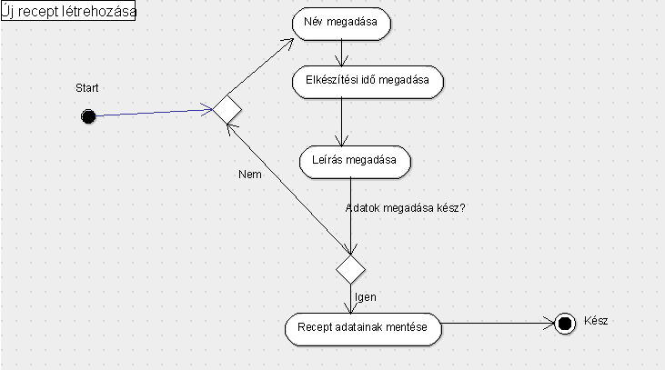

# Dokumentáció

## 1. Követelményanalízis

### 1.1. Követelmények összegyűjtése
#### 1.1.1. Funkcionális elvárások
Egy webes vastagkliens, azaz egyoldalas alkalmazás készítése Ember.js segítségével. 
A feladatnak mininálisan tartalmaznia kell:
  -  legalább két modellt, egy-sok kapcsolatban
  -  legalább 1 űrlapot
  -  legalább 1 listázó oldalt
  -  legyen lehetőség új felvételére
  -  legyen lehetőség meglévő szerkesztésére
  -  legyen lehetőség meglévő törlésére
  -  REST API végpont kialakítása
  -  szerveroldali perzisztálás fájlba

#### 1.1.2. Nem funkcionális követelmények
- Használhatóság: a látogatók által elért felület legyen jól átlátható, önmagyarázó (egy átlagos látogató felhasználói dokumentáció nélkül is tudja használni).
- Biztonság: az adatok ne vesszenek el. 
- Karbantarthatóság: a weboldal legyen könnyen bővíthető. Egy új oldallal, menüvel, vagy használati esettel való bővítés legyen egyértelmű, és gyorsan végrehajtható.

### 1.2. Szakterületi fogalomjegyzék

### 1.3. Használatieset-modell
#### 1.3.1. Szerepkörök
Most csak vendég szerepkör van, mivel nem szükséges egy funkcióhoz sem bejelentkezni.
Vendég: Az a felhasználó, aki azonosítatlanul használja az alkalmazást. A vendég felhasználó csak a publikus oldalakat és funkciókat érheti el. Ilyenek a receptek létrehozása, módosítása, törlése, listázása valamint az alapanyagok létrehozása, módosítása, törlése és listázása.

#### 1.3.2. Használati eset diagramok

#### 1.3.3. Folyamatok pontos menete

Cím: Új recept létrehozása
Cél: Új recept létrehozása.
Előfeltétel: Kötelező adatok megadása.
Utófeltétel: Az alapanyag mentése sikeres.

Folyamat leírása:
Az alábbi lépések végrehajtása szükséges:
- Az alábbi adatokat kell a felhasználónak kötelezően megadnia egy új recept létrehozásakor: név, elkészítési idő, leírás.
- Recept mentése

## 2. Tervezés

### 2.1. Architektúra terv
#### 2.1.1. Oldaltérkép
Publikus:
- Főoldal
- Receptek listája
    - új recept
    - recept szerksztése
    - recept törlése
- Alapanyagok listája
    - új alapanyag
    - alapanyag szerkesztése
    - alapanyag törlése

#### 2.1.2. Végpontok
/: főoldal
/alapanyagok/list: alapanyagok listája
/alapanyagok/new: új alapanyag
/alapanyagok/edit: alapanyag szerkesztése
/receptek/list: receptek listája
/receptek/new: új recept
/receptek/edit: recept módosítása

### 2.3. Felhasználóifelület-modell
Főoldal

Alapanyagok listája

Új alapanyag, alapanyag módosítása

### 2.3. Osztálymodell
#### 2.3.1. Adatmodell

#### 2.3.2. Adatbázisterv

#####Táblák
Recept
Leírás: A receptek adatai ebben a táblában kerülnek tárolásra.
Attribútumok:
  - id: recept azonosítója az adatbázisban
  - nev: recept neve
  - elkeszitesi_ido: recept elkészítési ideje
  - leiras: recept leírása
  - alapanyagok: recept alapanyagai
    
Alapanyag
Leírás: Az alapanyagok adatai ebben a táblában kerülnek tárolásra.
Attribútumok:
  - id: alapanyag azonosítója az adatbázisban
  - nev: alapanyag neve
  - mennyiseg: alapanyag mennyisége
  - recept: melyik recepthez tartozik az alapanyag

Kapcsolatok: Egy recepthez sok alapanyag tartozik, egy alapanyag csak egy recepthez tartozhaz (egy-sok kapcsolat).

#### 2.3.3. Állapotdiagram

### 2.4. Dinamikus működés
#### 2.4.1. Szekvenciadiagram

## 3. Implementáció

### 3.1. Fejlesztői környezet bemutatása
Ember.js segítségével lett megírva a program Cloud9 fejlesztői környezetben.

### 3.2. Könyvtárstruktúrában lévő mappák funkiójának bemutatása
Az app/pods mappában:
  - alapanyag mappában van az alapanyag model
  - alapanyagok mappában:
      - new mappában: új alapanyag létrehozásához szükséges fájlok (controller.j, router.j, template.hbs)
      - edit mappában: alapanyag módosításához szükséges fájlok (controller.j, router.j, template.hbs)
      - list mappában: alapanyagok listázásához szükséges fájlok (controller.j, router.j, template.hbs)
  - recept mappában van a recept model
  - receptek mappában:
      - new mappában: új recept létrehozásához szükséges fájlok (controller.j, router.j, template.hbs)
      - edit mappában: recept módosításához szükséges fájlok (controller.j, router.j, template.hbs)
      - list mappában: receptek listázásához szükséges fájlok (controller.j, router.j, template.hbs)
  - components mappában van a különböző oldalak megjelenítéséhez szükséges leírások és az űrlapok kezelése
A docs/images mappában vannak a dokumentációhoz szükséges képek és ábrák.

## 4. Tesztelés

### 4.1. Kipróbált tesztesetek
- új recept
- recept módosítása
- új alapanyag
- alapanyag módosítása
- alapanyag törlése

## 5. Felhasználói dokumentáció

### 5.1. A futtatáshoz ajánlott hardver-, szoftver konfiguráció
- Google Chrome vagy Firefox
- Windows 7 vagy 8

### 5.2. Telepítés lépései

### 5.3. A program használata
A kezdőoldalról elérhető a receptek listáját mutató oldal, illetve az alapanyagok listáját mutató oldal.

A receptek listájánál létrehozhatunk új receptet, illetve módosíthatunk már korábban létrehozottat.
Új recept létrehozásakor meg kell adni a recept nevét, elkészítési idejét, valamint a leírását. Mindegyik tuajdonságot kötelező megadni. Egyik tulajdonság sem egyedi, azaz két receptet is föl lehet venni, aminek minden tulajdonsága megegyezik.

Az alapanyagok listájánál létrehozhatunk új alapanyagok, módosíthatunk már korábban létrehozottat, illetve törölhetünk is. Új alapanyag létrehozásakor meg kell adni az alapanyag nevét, a mennyiségét, valamint azt , hogy melyik recepthez tartozik. Mindegyik tuajdonságot kötelező megadni. Egyik tulajdonság sem egyedi, azaz két alapanyagot is föl lehet venni, aminek minden tulajdonsága megegyezik.

Nem a receptek létrehozásánál adjuk meg a hozzá tartozó alapanyagokat, hanem egy-egy alapanyag létrehozásakor adjuk meg, hogy ő melyik recepthez tartozik. Egy alapanyag csak egy recepthez tartozhat, de egy recepthez sok alapanyag tartozhat.

Létező recept/alapanyag szerkesztésekor a szerkeszteni kívánt recept/alapanyag melletti 'Módosítás' gombra kattintva kerülünk a szerkesztés oldalra. Itt már be vannak másolva a mezőkbe a recept adatai. Itt lehet őket módosítani, majd a 'Submit' gombbal mentésre kerülnek a változások és visszakerülünk a recepteket/alapanyagokat listázó oldalra.

Létező alapanyag törléséhez a törölni kívánt alapanyag melletti 'Törlés' gombra kell kattintani. Ekkor továbbra is ottmaradunk a listázó oldalon, de az az alapanyag már nem jelenik meg a listában.

Receptek nem törölhetők.
